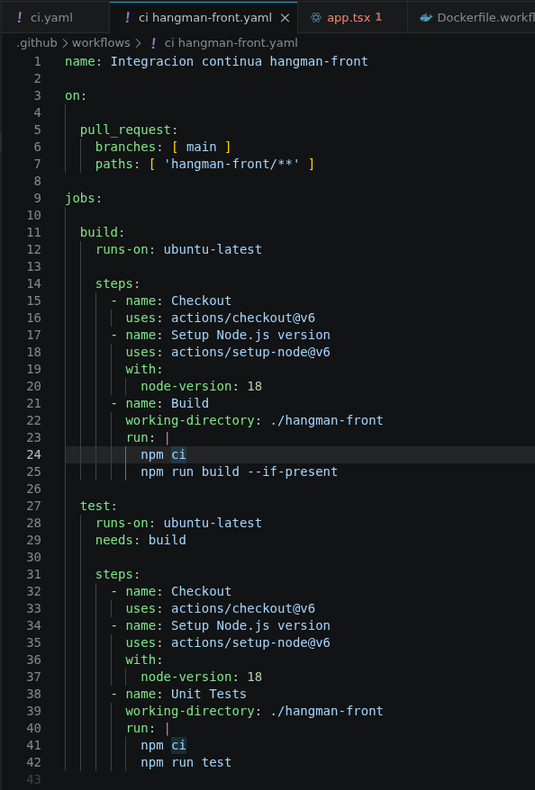
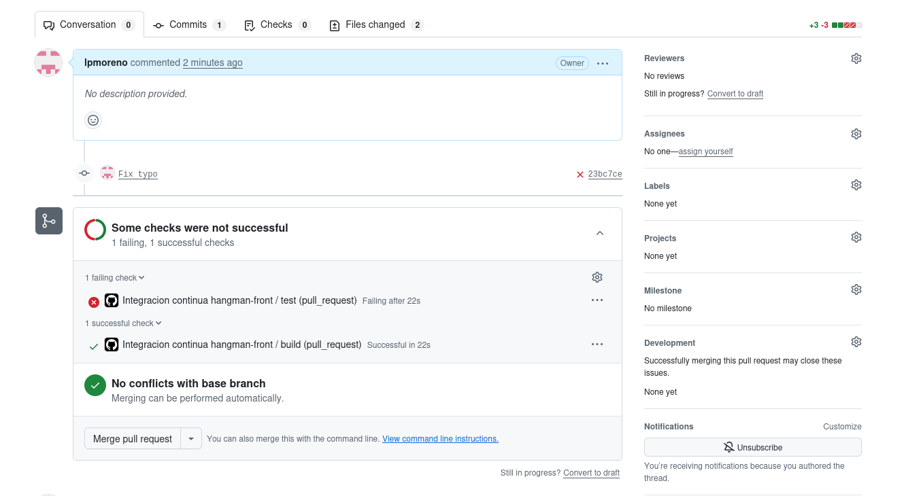
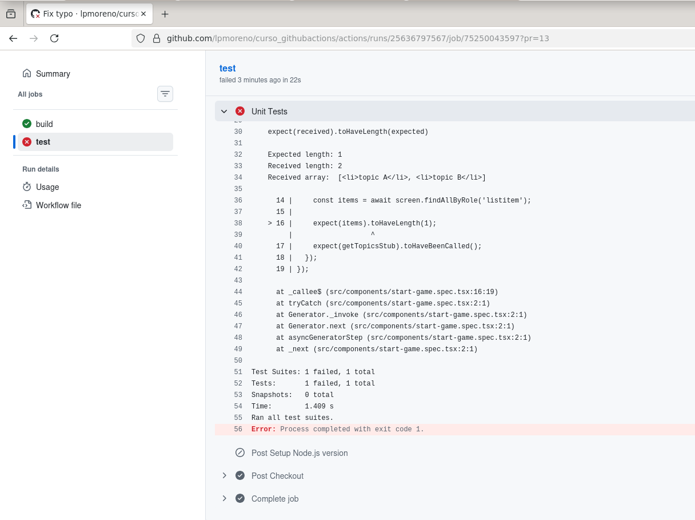
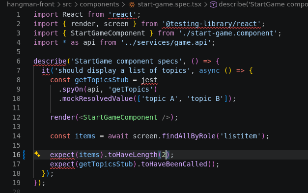
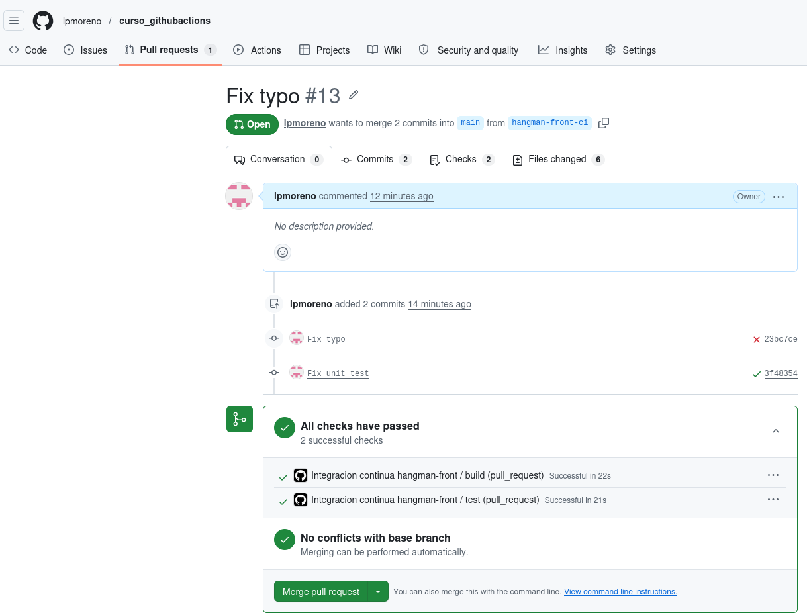
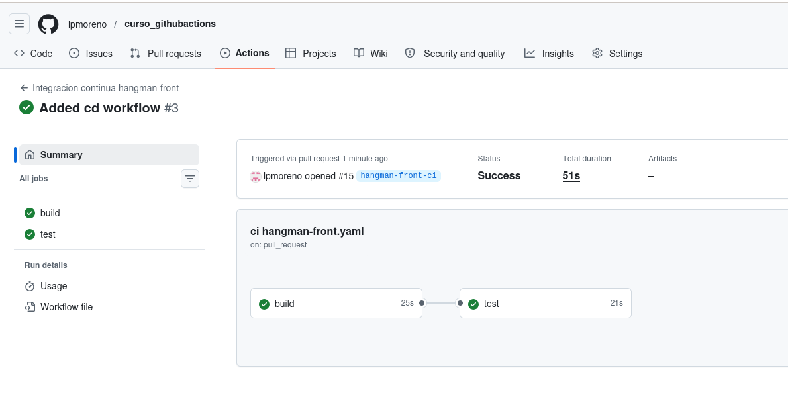
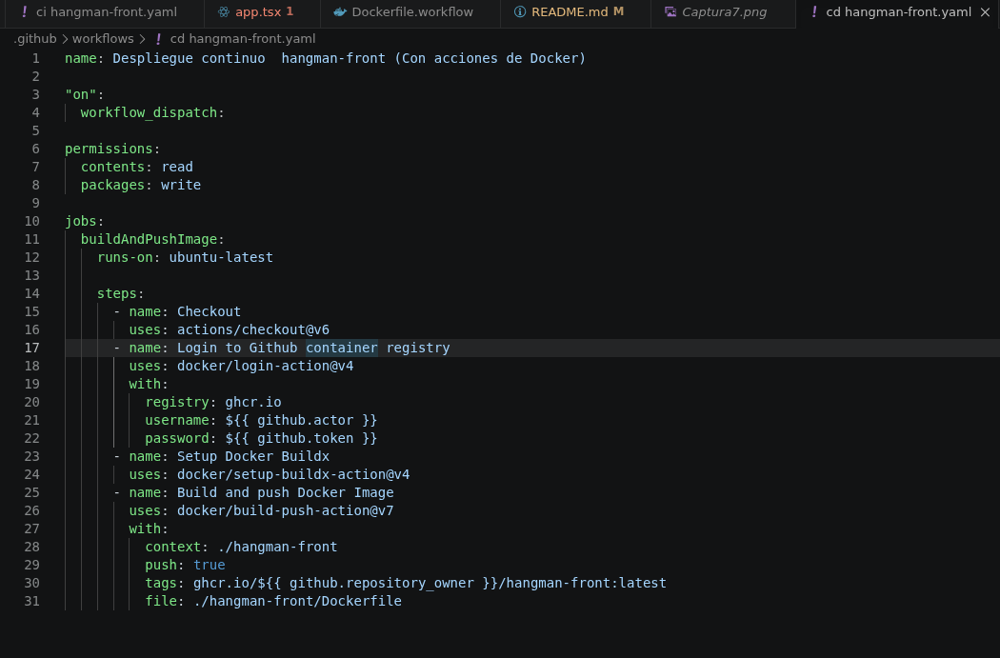
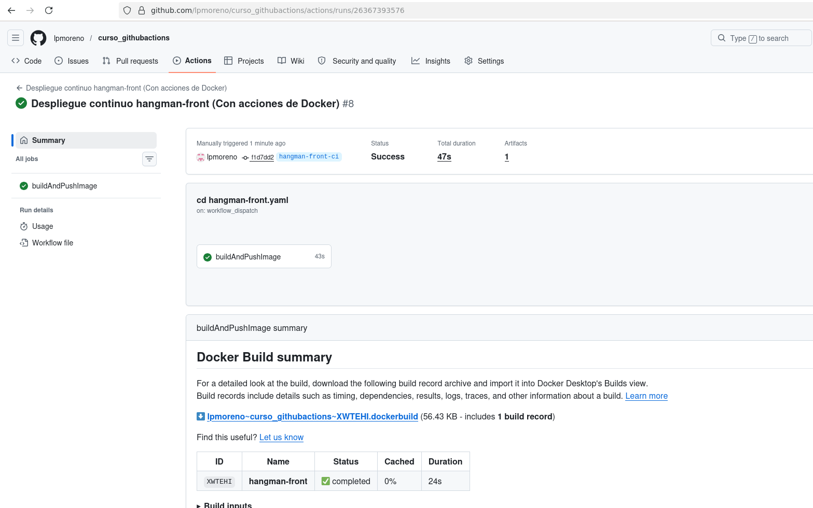

# Curso Github actions
# Laura Paneque Moreno

# Workflow para el ejecutar el CI del proyecto de frontend

En primer lugar creamos el archivo ci hangman-front.yaml con el siguiente contenido:

Lanzamos el CI desde Github y comprobamos que se ha producido un error.

Consultamos el detalle del error y podemos observar que ha fallado uno de los tests:

Corregimos el código, y volvemos a lanzar el ci, que finaliza correctamente:

# Workflow para el ejecutar el CD del proyecto de frontend

Pasamos ahora al continuous delivery.

Creamos el archivo que realizará el despliegue:

Tras corregir algunos errores en el archivo yaml, conseguimos ejectutar correctamente la acción CD:

Podemos descargar el artifact generado desde la siguiente URL:
https://github.com/lpmoreno/curso_githubactions/actions/runs/26367393576/artifacts/7186871836

